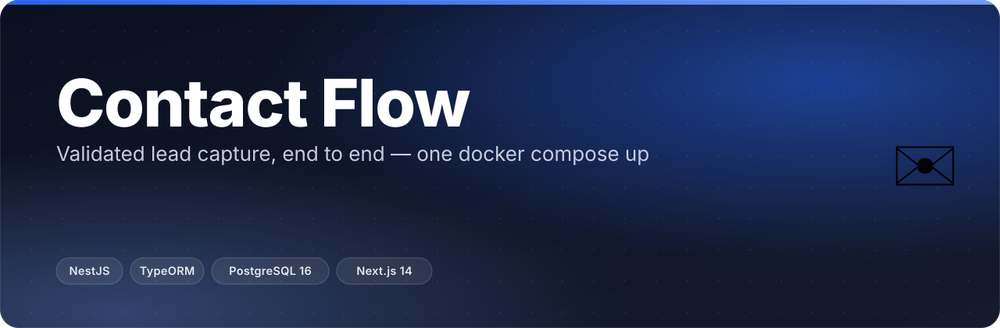
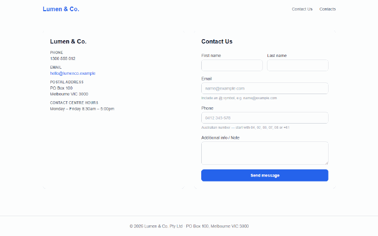
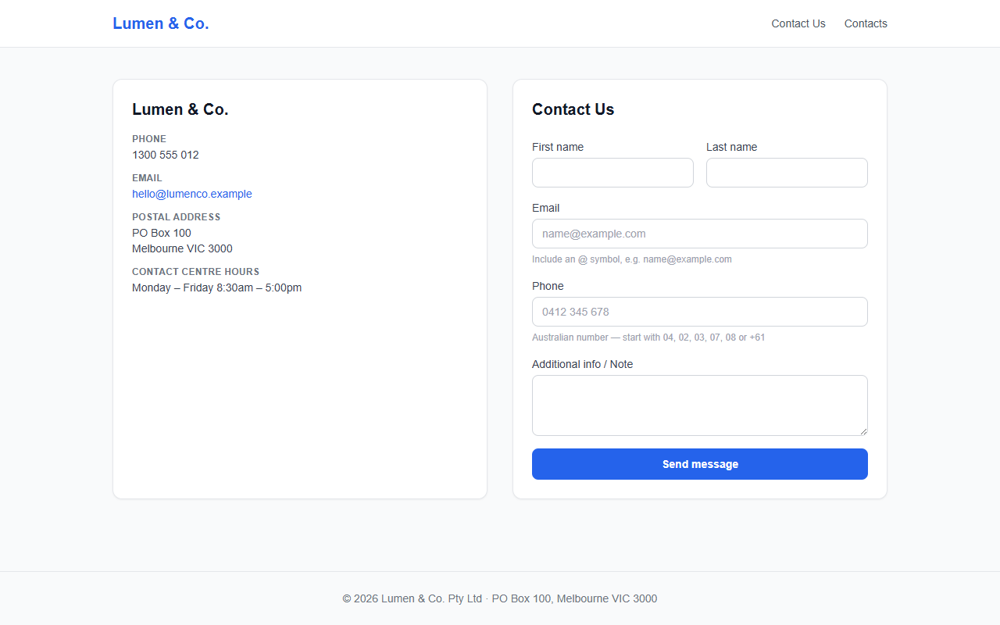
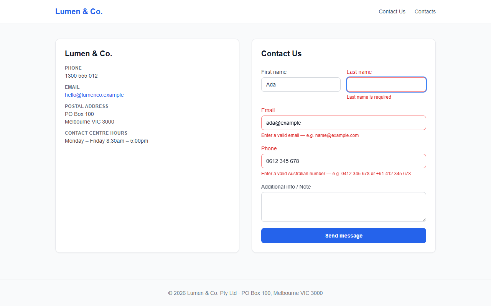
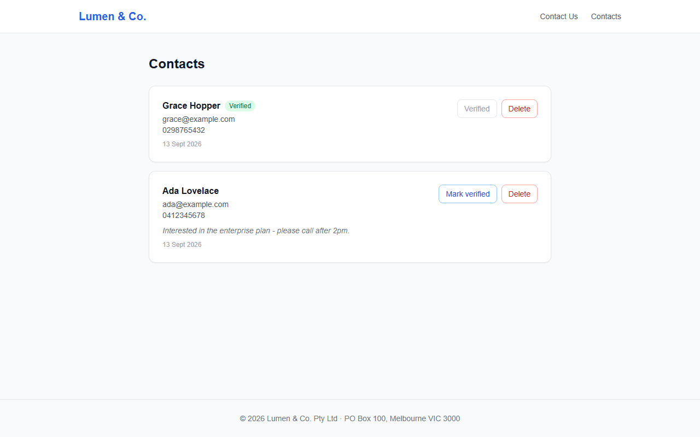
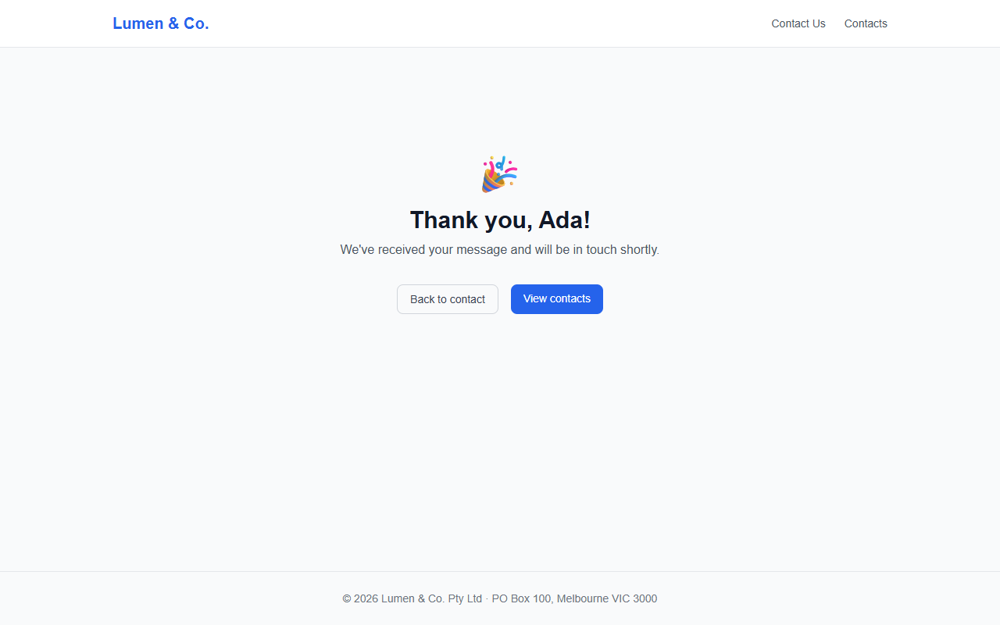
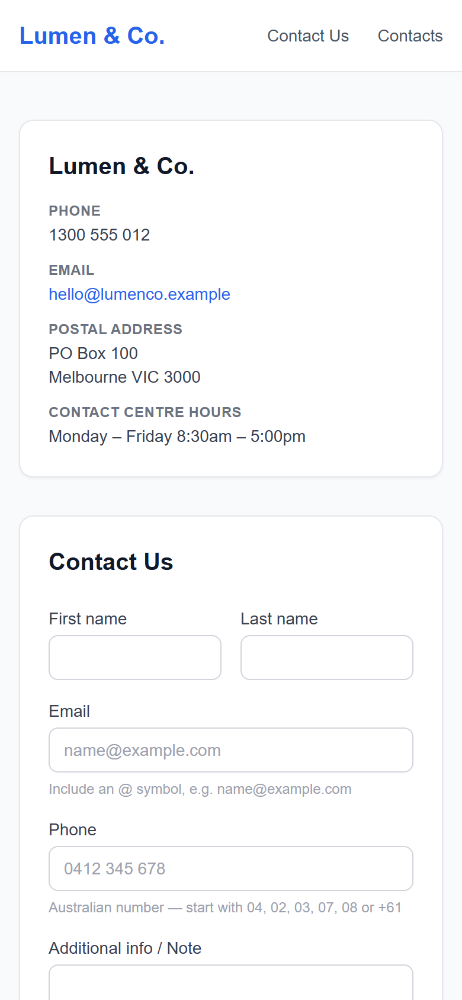
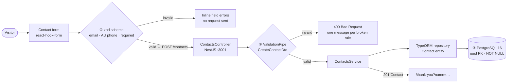

<p align="center"></p>

<p align="center">
  <b>A contact form is the easiest thing in web dev to get wrong. This one is done properly on both sides — and it boots with one command.</b>
</p>

<p align="center">
  
  
  
  
  
  
</p>

A production-shaped **contact / lead-capture flow**, end to end: validated form in, reviewed
contact out. NestJS + TypeORM + PostgreSQL API, Next.js 14 (App Router) + Tailwind frontend,
one `docker compose up` to run the lot.

Branding ("Lumen & Co.") is a fictional demo company — swap the strings and this is a drop-in
contact stack for any site.

## ✨ What it does

- **Validation twice, deliberately.** The API is the source of truth (`class-validator` DTOs,
  an Australian phone regex); the browser mirrors the *same* rules with react-hook-form + zod
  so the user gets the error before the request is even sent.
- **Error messages that say what to fix.** Not "invalid phone" — *"Australian numbers start
  with 04, 02, 03, 07, 08 or +61"*, then *"e.g. 0412 345 678 or +61 412 345 678"*. Typed input
  like `0412 345 678` and `(04) 1234 5678` is normalised before it is validated or sent.
- **Clean NestJS layering, no shortcuts:** entity → DTO → service → controller, with the
  global `ValidationPipe` (`whitelist: true`) stripping unknown keys off every request body.
- **A live contacts list** with mark-verified / delete actions, newest-first, revalidated
  through SWR after every mutation.
- **Real tests on the API** — 26 Jest cases over the service and the DTO validator, including
  5 accepted and 7 rejected Australian phone formats.
- **An AI reviewer wired into the repo.** [`.claude/`](.claude/README.md) ships a subagent whose
  first job is checking that the zod schema and the class-validator DTO have not drifted apart,
  plus a hook that blocks hand-edits to generated files.

## 🎬 See it

Filling the form with bad input, watching the client catch it, fixing it, and landing on the
thank-you page — recorded against the real stack running under `docker compose`:

<p align="center"></p>

<table><tr>
<td width="50%"><br><sub><b>/contact</b> — company details beside the form, with format hints under email and phone.</sub></td>
<td width="50%"><br><sub><b>Client-side validation</b> — zod rejects an empty name, <code>ada@example</code> and the invalid <code>06</code> prefix. No request leaves the browser.</sub></td>
</tr><tr>
<td width="50%"><br><sub><b>/contacts</b> — newest first, with verify and delete per row. Verified contacts lock the button.</sub></td>
<td width="50%"><br><sub><b>/thank-you</b> — greets the submitter by the first name returned by the API, not by the one typed.</sub></td>
</tr></table>

<p align="center"><br><sub>390 px viewport — the two-column grid collapses to stacked cards.</sub></p>

## 🧠 How it works

Three validation layers, each doing a different job. The browser one exists for speed of
feedback; the API one is the one that actually protects the database.



1. **`web/app/contact/page.tsx`** holds the zod schema, kept deliberately identical to the
   backend DTO (the file says so, and the reviewer subagent checks it). Phone input is run
   through `normalizePhone()` — spaces, dashes and brackets stripped — before both validation
   and submission, so the API always receives a clean value.
2. **`web/lib/api.ts`** is a typed `fetch` client. The whole frontend is client-rendered inside
   the App Router: every call happens in the browser, against `NEXT_PUBLIC_API_URL` baked in at
   build time. A non-2xx response is turned into an `Error` carrying the API's `message`, which
   `useCreateContact` surfaces as a red banner above the submit button.
3. **`api/src/main.ts`** installs the global `ValidationPipe` with `whitelist: true` and CORS
   locked to `WEB_ORIGIN`. A bad payload never reaches the service:

   ```console
   $ curl -s -X POST localhost:3001/contacts -H 'Content-Type: application/json' \
       -d '{"firstName":"Ada","lastName":"Lovelace","email":"not-an-email","phone":"0612345678"}'
   {"message":["email must be an email",
               "phone must be a valid Australian phone number (e.g. 0412345678 or +61412345678)"],
    "error":"Bad Request","statusCode":400}
   ```
4. **`api/src/contacts/contacts.service.ts`** is the only thing that talks to the repository —
   `findAll` orders `createdAt DESC`, `update` and `remove` throw `NotFoundException` on an
   unknown id rather than silently no-op'ing.
5. **Postgres** holds the last word: uuid primary key, `NOT NULL` on every required column,
   `createdAt` filled by the database. TypeORM runs with `synchronize: true`, so the schema
   follows the entity on boot — convenient for a demo, a migration story for production.

## 🚀 Quick start

**Prerequisite:** [Docker Desktop](https://www.docker.com/products/docker-desktop/) (or Docker
Engine + Compose v2). Nothing else — no local Node, no local Postgres.

```bash
docker compose up --build
```

Then open **http://localhost:3000**.

| Service | URL | Notes |
|---------|-----|-------|
| Web | http://localhost:3000 | Next.js 14, standalone production build |
| API | http://localhost:3001 | NestJS, `POST/GET/PATCH/DELETE /contacts` |
| DB | *(internal)* | Postgres 16 on the compose network, data in the `pgdata` volume |

To stop and wipe the data:

```bash
docker compose down -v
```

<details>
<summary><b>Develop locally without Docker</b></summary>

**API** (requires a running Postgres on port 5432):

```bash
cd api
npm install
DB_HOST=localhost DB_PASS=postgres npm run start:dev
```

**Web:**

```bash
cd web
npm install
NEXT_PUBLIC_API_URL=http://localhost:3001 npm run dev
```

**Tests and checks:**

```bash
cd api && npm test          # jest — service + DTO validation specs
cd api && npm run lint      # eslint + prettier
cd web && npm run typecheck # tsc --noEmit
cd web && npm run build     # next build (standalone output)
```

</details>

<details>
<summary><b>API reference</b></summary>

| Method | Path | Body | Response |
|--------|------|------|----------|
| `POST` | `/contacts` | `CreateContactDto` | `201` `Contact` |
| `GET` | `/contacts` | — | `200` `Contact[]` (newest first) |
| `PATCH` | `/contacts/:id` | `UpdateContactDto` (partial) | `200` `Contact` · `404` if unknown |
| `DELETE` | `/contacts/:id` | — | `204` · `404` if unknown |

**`Contact`**

| Field | Type | Notes |
|-------|------|-------|
| `id` | `uuid` | generated primary key |
| `firstName` / `lastName` | `string` | required, non-empty |
| `email` | `string` | required, valid email |
| `phone` | `string` | required, matches `/^(\+?61\|0)[2-578]\d{8}$/` |
| `note` | `string \| null` | optional |
| `verified` | `boolean` | defaults to `false`, set via `PATCH` |
| `createdAt` | `timestamp` | set by the database |

Unknown keys in a request body are stripped by the `ValidationPipe` (`whitelist: true`)
rather than persisted.

</details>

<details>
<summary><b>Environment variables</b></summary>

| Variable | Default | Used by |
|----------|---------|---------|
| `DB_HOST` | `localhost` (`db` under compose) | api |
| `DB_PORT` | `5432` | api |
| `DB_USER` | `postgres` | api |
| `DB_PASS` | `postgres` | api |
| `DB_NAME` | `lumenco` | api |
| `WEB_ORIGIN` | `http://localhost:3000` | api — CORS allow-list |
| `NEXT_PUBLIC_API_URL` | `http://localhost:3001` | web — **baked in at build time** (compose passes it as a build arg) |

</details>

<details>
<summary><b>Troubleshooting</b></summary>

**`api` exits with `database "lumenco" does not exist`.** A `pgdata` volume left over from an
earlier run with a different `POSTGRES_DB` is being reused — Postgres only runs its init step
on an empty data directory. Wipe it and start again:

```bash
docker compose down -v && docker compose up --build
```

**The form submits but shows "Couldn't send your message".** The API is unreachable from the
*browser*, not from the container. `NEXT_PUBLIC_API_URL` is compiled into the client bundle, so
it must be an address the browser can reach (`http://localhost:3001`), not a compose service
name.

</details>

## 🗂️ Project layout

```
├── api/                                NestJS + TypeORM + PostgreSQL
│   ├── src/contacts/
│   │   ├── contact.entity.ts           the data model
│   │   ├── dto/                        class-validator contracts (create + partial update)
│   │   ├── contacts.{service,controller}.ts  business logic · HTTP layer
│   │   └── *.spec.ts                   jest: service behaviour + DTO validation
│   ├── src/main.ts                     ValidationPipe + CORS + port 3001
│   └── Dockerfile                      multi-stage node:20-alpine, prod deps only
├── web/                                Next.js 14 App Router + Tailwind
│   ├── app/contact/page.tsx            the form + the zod schema that mirrors the DTO
│   ├── app/{contacts,thank-you}/       the list · the personalised confirmation
│   ├── hooks/ · lib/api.ts             SWR hooks · typed fetch client
│   └── Dockerfile                      multi-stage → .next/standalone
├── docker-compose.yml                  db (healthcheck-gated) → api → web
├── CLAUDE.md · AI_USAGE.md · .claude/  the spec · the AI disclosure · reviewer config
└── docs/assets/                        the banner, screenshots and GIF above
```

## 🧰 Stack

| Layer | Choice | Why |
|-------|--------|-----|
| API framework | NestJS 11 | DI + decorators make the entity → DTO → service → controller split the path of least resistance |
| Validation | class-validator 0.15 + global `ValidationPipe` | validation lives on the DTO, so the contract and its rules are one file |
| ORM | TypeORM 1.0 | entity-first; `synchronize: true` keeps the demo schema in step with the code |
| Database | PostgreSQL 16 | uuid PKs and real `NOT NULL` constraints as the last line of defence |
| Frontend | Next.js 14 App Router + React 18 | file-routed pages; the flow is client-rendered inside it |
| Forms | react-hook-form 7 + zod 4 | the same rules as the DTO, evaluated before the request |
| Data fetching | SWR 2 | mutate-then-revalidate keeps the contacts list honest after verify/delete |
| Styling | Tailwind CSS 3 | error states are a conditional class, not a stylesheet |
| Runtime | Docker Compose, node:20-alpine | `db` gated on a `pg_isready` healthcheck before `api` starts |

## 🗺️ Status & roadmap

- ✅ Full flow working end to end under `docker compose up` — form, validation on both sides,
  persistence, thank-you page, contacts list with verify/delete.
- ✅ API unit tests green — `26 passed, 26 total` across 2 suites from `npm test` in `api/`.
  ESLint + Prettier and `tsc --noEmit` are wired up as scripts on both apps.
- 🚧 `synchronize: true` is demo-grade. Production wants real TypeORM migrations.
- 🔜 No auth on `/contacts` — the list and its delete action are open. Fine for a showcase,
  not for a live site.
- 🔜 No rate limiting or spam protection on `POST /contacts`.
- 🔜 The AU phone rule is hard-coded in two places by design; internationalising it means
  replacing both with a shared, generated schema.

## 🤝 Notes

Built to a written spec — [`CLAUDE.md`](CLAUDE.md) holds the entity, endpoints, routes and
validation contract this was implemented against. AI assistance is disclosed in full in
[`AI_USAGE.md`](AI_USAGE.md), including the committed [`.claude/`](.claude/README.md) project
config (hooks, reviewer subagent, slash commands). There is no `LICENSE` file in the repo and
`api/package.json` is marked `UNLICENSED` — ask before reusing it.

<p align="center"><sub>Built by <a href="https://github.com/ChinmayGit8765">Chinmay</a> · part of the <a href="https://chinmaygit8765.github.io/exaryn-studio/">Exaryn</a> studio</sub></p>
